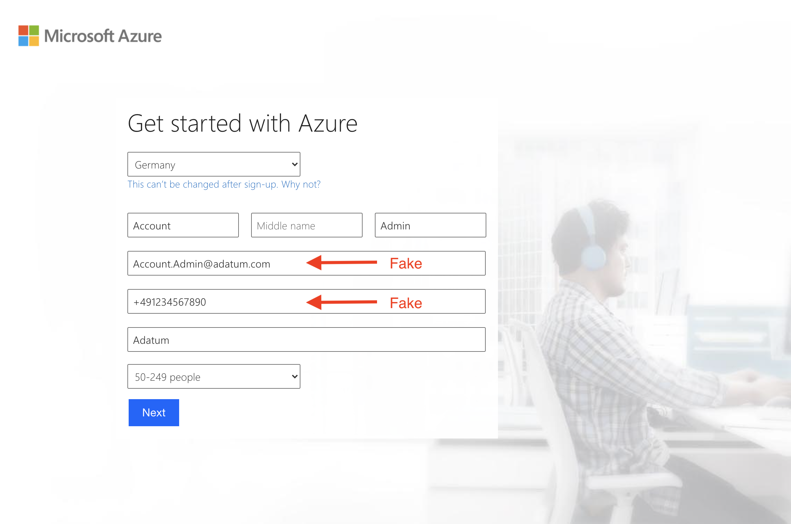
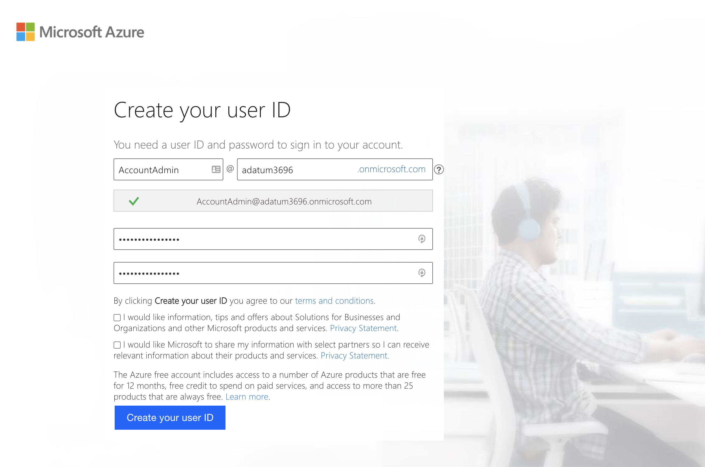
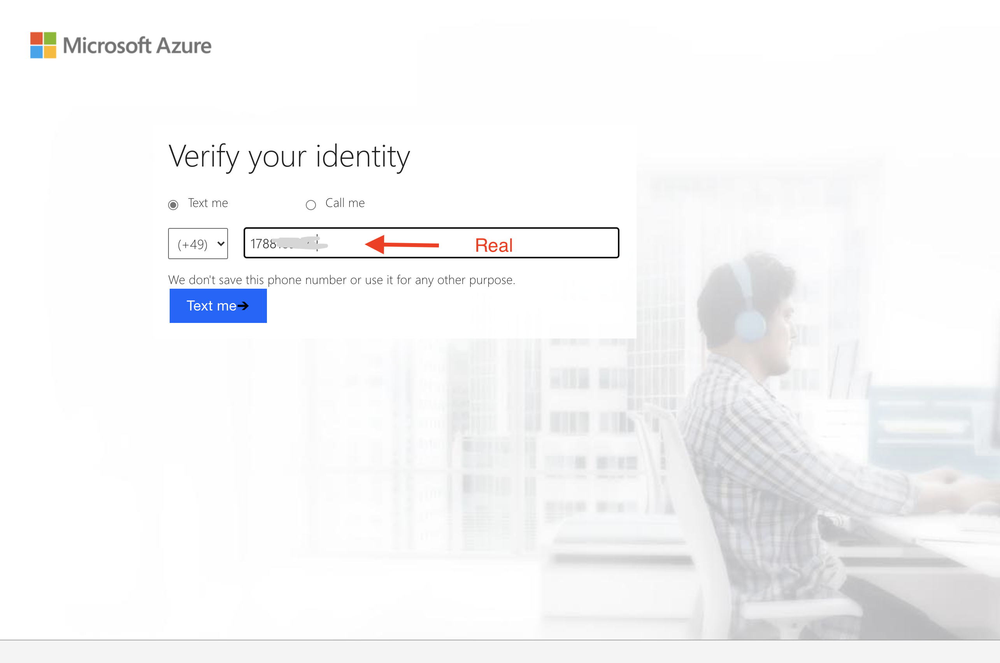
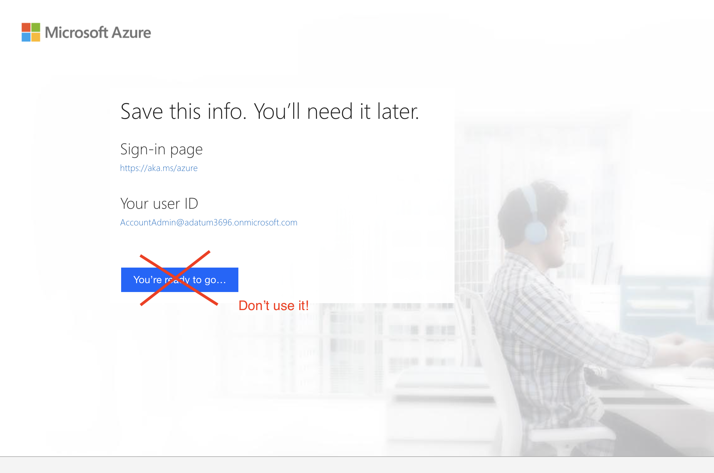

# Create a new Azure AD tenant

**Important! Telephone number is required.**

Open a privat (incognito) browser window. Go to <a href="https://account.azure.com/organization" target="_blank"> https://account.azure.com/organization</a>. Fill in the form.

Remember your user account (e.g. AccountAdmin&#64;adatum3696.onmicrosoft.com) and your password!

Telephone number has to be correct!

After completion you will be offered an Azure Free Account - Don't use it!

Congratulation! You have created a new Azure AD tenant.