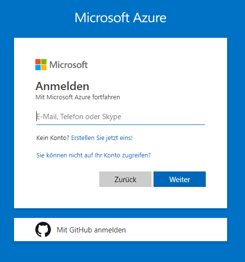
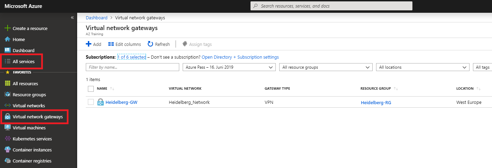
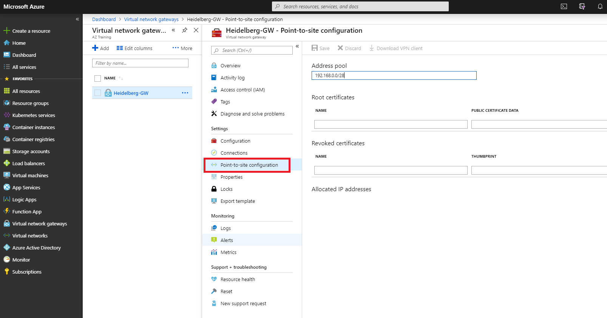
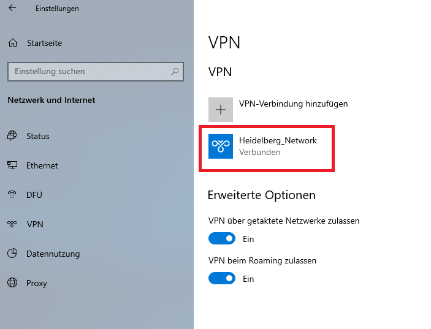

# Point-to-Site VPN to Azure

## Azure Portal
Login to Azure Portal [https://portal.azure.com](https://portal.azure.com). Ask the intructor about login credentials!
<details>


</details>

Find the Virtual Gateway *Heidelberg-GW*. Hint: All services!
<details>


</details>

Locate the Point-to-site configuration
<details>


</details>


## Certificates

Start a local PowerShell.

Think of a name, e.g. *Paul*.
<details>

 ```powershell
 $Name = "Paul"

$RootCertName   = $Name + "-RootCertificate"
$ClientCertName = $Name + "-ClientCertificate"
```
</details>

Generate new Root certificate *Paul-RootCertificate*.
<details>

```powershell
$RootCert = New-SelfSignedCertificate `
              -Subject   "CN=$RootCertName" `
              -FriendlyName  $RootCertName `
              -CertStoreLocation 'Cert:\CurrentUser\My' `
              -Type Custom `
              -KeySpec Signature `
              -KeyExportPolicy Exportable `
              -HashAlgorithm sha256 `
              -KeyLength 2048 `
              -KeyUsageProperty Sign `
              -KeyUsage CertSign
```
</details>

Generate new Client certificate *Paul-ClientCertificate* signed by Root certificate.
<details>

```powershell
New-SelfSignedCertificate `
  -Subject  "CN=$ClientCertName" `
  -FriendlyName $ClientCertName `
  -CertStoreLocation 'Cert:\CurrentUser\My' `
  -Type Custom `
  -KeySpec Signature `
  -KeyExportPolicy Exportable `
  -HashAlgorithm sha256 `
  -KeyLength 2048 `
  -Signer $RootCert `
  -TextExtension @("2.5.29.37={text}1.3.6.1.5.5.7.3.2")
```
</details>

List all your personal certificates. You should see both Root as well as Client certificates.
<details>

```powershell
Get-ChildItem Cert:\CurrentUser\My | sort Subject
```
</details>

Copy Root certificate into clipboard
<details>

```powershell
[System.Convert]::ToBase64String($rootCert.RawData) | clip
```
</details>

Paste it into Azure Portal!
<details>


</details>


## VPN client

Download VPN client.

Extract VpnClientSetupAmd64.exe from zip file

Run the installer. 

Test the VPN. Good luck!
<details>

