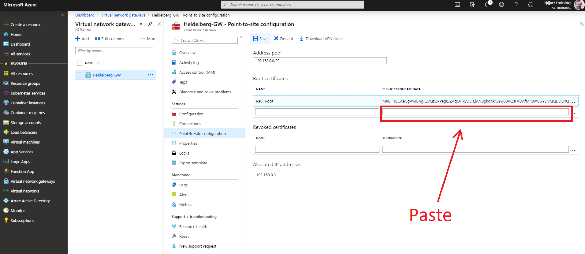

# Lab: Point-To-Site VPN

## Lab Instructions

### Start Cloud Shell (Bash)

```bash
az account list -o table
```

### Some Variables

```bash
Location="westeurope"

az group list -o table
RGroup="az3000401-LabRG"

az network vnet list -o table
VNet_Name="az3000401-vnet"
```


### Create Subnet "GatewaySubnet"

```bash
VNet_GatewaySubnetPrefix="10.0.2.240/28"
az network vnet subnet create --name GatewaySubnet \
                              --address-prefix $VNet_GatewaySubnetPrefix \
                              --vnet-name $VNet_Name \
                              --resource-group $RGroup

az network vnet subnet list --resource-group $RGroup --vnet-name $VNet_Name -o table
```

### Create Public IP (PIP)

```bash
Vng_Name="AdatumVNG"
Vng_Pip="$Vng_Name-Pip"
az network public-ip create --name $Vng_Pip \
                            --resource-group $RGroup \
                            --allocation-method dynamic \
                            --location $Location

az network public-ip list -o table --resource-group $RGroup
```

### Create Virtual Network Gateway (VNG)

```bash
Vng_ClientAddressPrefix="192.168.0.0/24"
az network vnet-gateway create --name $Vng_Name \
                               --location $Location \
                               --resource-group $RGroup \
                               --vnet $VNet_Name \
                               --address-prefixes $Vng_ClientAddressPrefix \
                               --public-ip-addresses $Vng_Pip \
                               --vpn-type RouteBased \
                               --sku Basic \
                               --no-wait

az network vnet-gateway list --resource-group $RGroup -o table
```

### Wait for ProvisioningState "Succeeded"

### Create Certificate for Point-to-Site VPN

Switch to local (Windows 10) PowerShell

```Powershell
$rootCert = New-SelfSignedCertificate `
              -Type Custom `
              -KeySpec Signature `
              -Subject 'CN=AdatumRootCertificate' `
              -KeyExportPolicy Exportable `
              -HashAlgorithm sha256 `
              -KeyLength 2048 `
              -CertStoreLocation 'Cert:\CurrentUser\My' `
              -KeyUsageProperty Sign `
              -KeyUsage CertSign `
              -FriendlyName 'AdatumRootCertificate'

[System.Convert]::ToBase64String($rootCert.RawData) | clip
```

Paste it into browser (Azure Portal) "Public certificate data".



```Powershell
New-SelfSignedCertificate `
  -Type Custom `
  -KeySpec Signature `
  -Subject 'CN=AdatumClientCertificate' `
  -KeyExportPolicy Exportable `
  -HashAlgorithm sha256 `
  -KeyLength 2048 `
  -CertStoreLocation 'Cert:\CurrentUser\My' `
  -Signer $rootCert `
  -TextExtension @("2.5.29.37={text}1.3.6.1.5.5.7.3.2") `
  -FriendlyName 'AdatumClientCertificate'

Get-ChildItem Cert:\CurrentUser\My
```

### Download VPN Client

### Test the VPN
